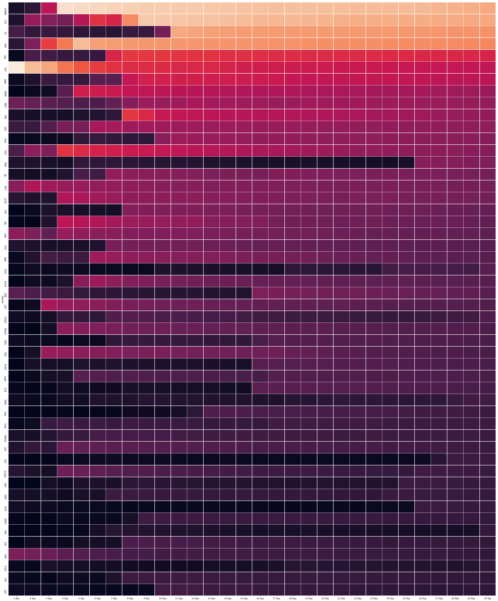
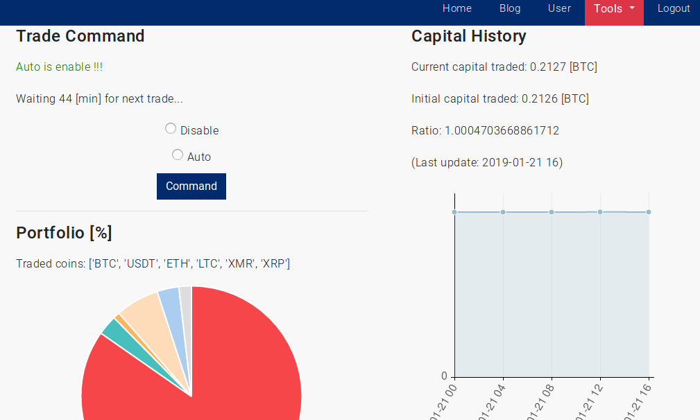
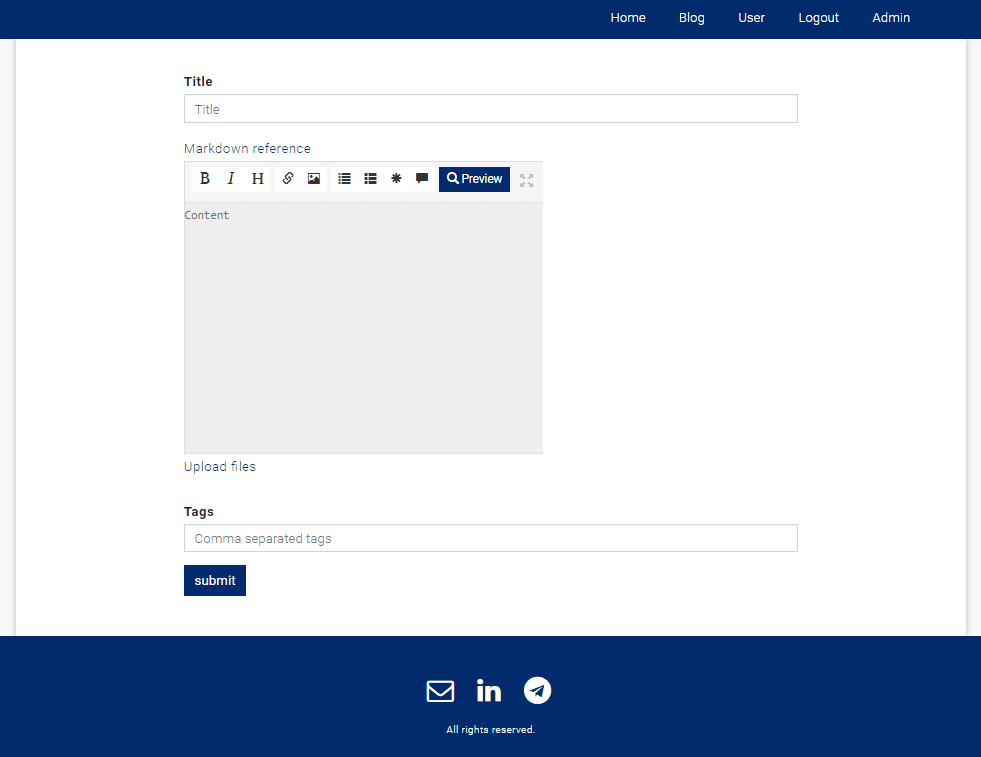
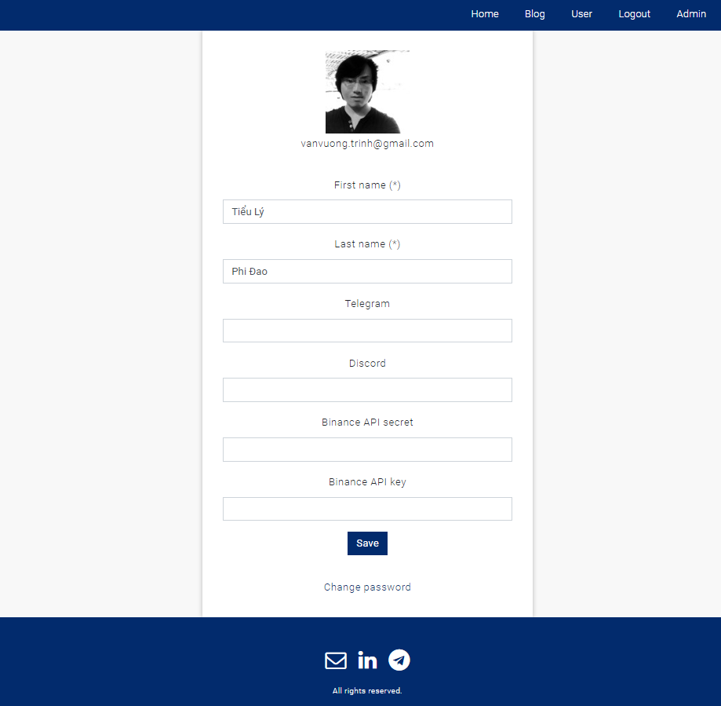

# Blockchain and Cryptoasset Analytics

Blockchain and Cryptoasset Analytics develops an intelligent data driven application to monitor blockchain projects and to analyze cryptoassets from both utility and speculation perspectives. We target blockchain entrepreneurs, investors and traders all along the life of projects: token generation, listing on secondary market, product delivery, product usage, and token valorization.

## Features

### Large Order Execution Detection

Large order execution detection based on volume weighted averaging transaction count over a 30 day period. A heat map represents trading activity is generated for portfolio building.

### Portfolio Optimization via Reinforcement Learning

### Content Management System (CMS)

## License

MIT
